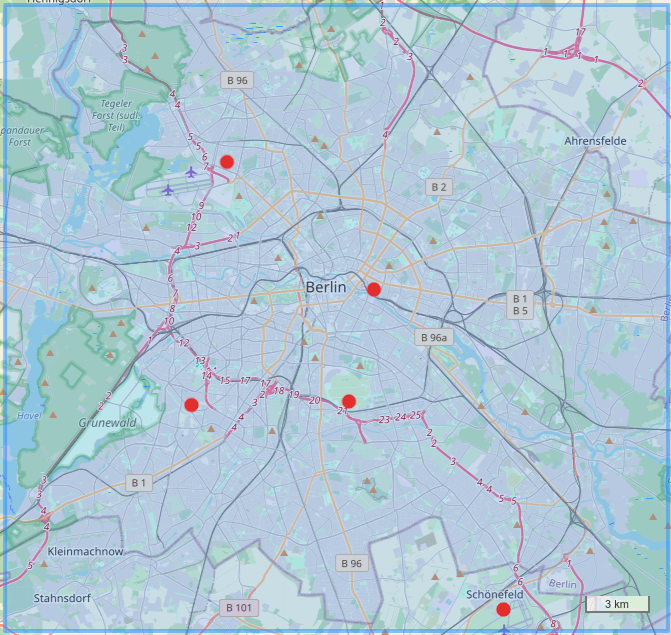
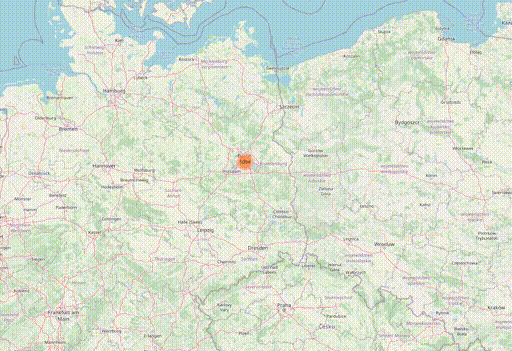
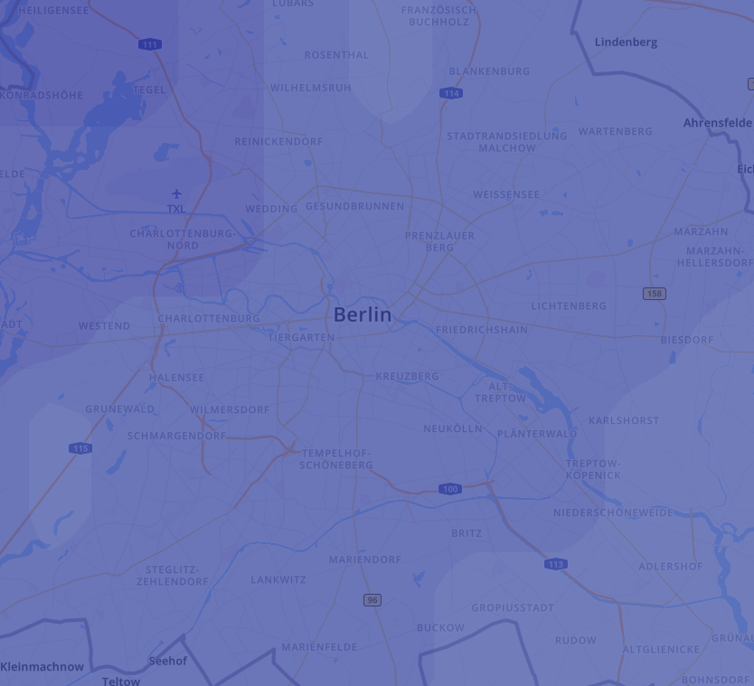
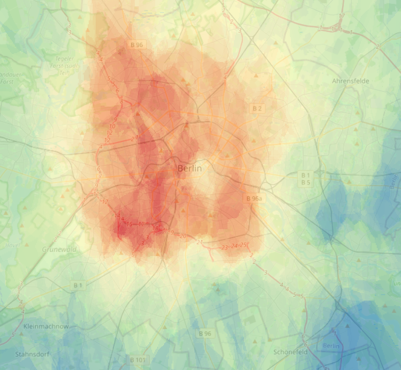
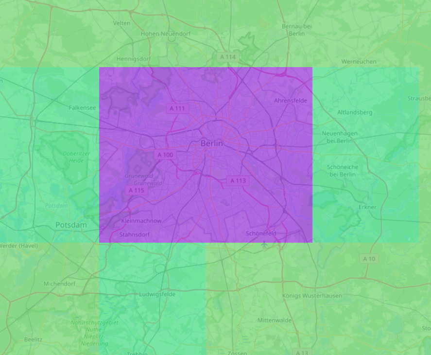
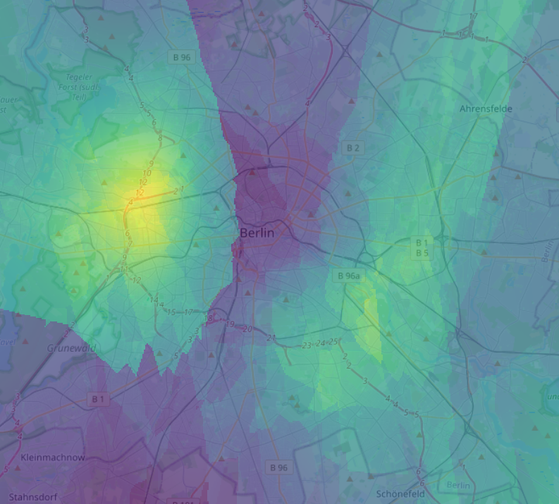

# Introducing Predly: How our technology enables high resolution weather forecasting

Weather forecasting models need observation data to determine the atmospheres condition. The more observations, the better the forecast.

In Berlin, there are only 5 government weather stations for an area of > 880 km² to provide ground observation data. That means, there is only 1 observation per ~180 km² in average. The American leading forecast system GFS can only predict 1 value for an area of 156.25 km³. The best resolution model by Germany's DWD (COSMO model) predicts in 4 km² grids, but relies on the same ground observation data.

## Example location: Berlin

Area: 89894.76 ha (898.9476km²)

## Gouvernment Sensors

The red dots are weather stations.

At Predly, we use sensors from various new data sources, resulting in over 1000 ground observations, just for Berlin. That means, we have 1 observation per 0.83 km² in average.

## Predly's Sensors

Animated sensor distribution in Berlin

Amount: 1093

With our algorithms, we clean and aggregate the data into a 75 m resolution. 

## Comparing existing data sources with our data

**Temps**

Weather.com (IBM) temperature forecast           |  Our data (copyright Predly.com):
:-------------------------:|:-------------------------:
  |  

**Rain**

Comparing a GFS rain forecast grid with our data.

GFS rain forecast           |  Our data (copyright Predly.com):
:-------------------------:|:-------------------------:
 |  

Interested in more? Stay tuned.

Copyright Predly.com and Clime.ai
